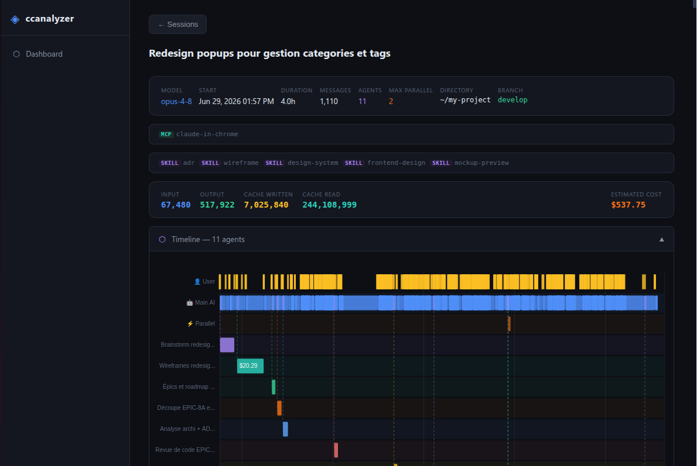

# ccanalyzer

A web-based dashboard for analyzing your [Claude Code](https://claude.ai/code) sessions — costs, token usage, agent activity, and conversation timelines.


[](https://www.npmjs.com/package/ccanalyzer)



## Usage

```bash
npx -y ccanalyzer@latest
```

Opens a local dashboard at **http://localhost:3737** in your browser.

If port 3737 is already in use, specify a different port with `-p`:

```bash
npx -y ccanalyzer@latest -p 3738
```

By default the server binds to `127.0.0.1` (localhost only). To expose it — for
example when running inside a Docker container where port-forwarding routes
through `eth0` rather than the container loopback — bind to all interfaces via
the `HOST` env var or the `--host` flag:

```bash
HOST=0.0.0.0 npx -y ccanalyzer@latest
# or
npx -y ccanalyzer@latest --host 0.0.0.0
```

## Features

- **Dashboard** — all projects with token counts, costs, and last activity (sortable columns)
- **Tool usage** — tool, skill, MCP-server and subagent activity, globally or filtered per project, as charts + sortable tables
- **Session browser** — list sessions per project sorted by recency, with a per-project tool-usage breakdown
- **Session detail** — full message thread with token/cost breakdown per exchange, plus a per-conversation tool-usage panel
- **Gantt timeline** — visual timeline of user turns, AI responses, and spawned agents
  - Click a **message bar** → see the exchange inline
  - Click an **agent bar** → open the full agent conversation in a popup
- **Agent popup** — complete agent conversation with stats (input/output tokens, cost)

## Custom config directory

By default, ccanalyzer reads `~/.claude`. To analyze a different Claude config directory (e.g. a work profile or a custom `CLAUDE_CONFIG_DIR`):

```bash
CLAUDE_CONFIG_DIR=/path/to/your/.claude npx -y ccanalyzer@latest
```

Example — analyze a secondary profile:

```bash
CLAUDE_CONFIG_DIR=~/.claude-work npx -y ccanalyzer@latest
```

## Docker

A ready-to-use [`docker-compose.yaml`](./docker-compose.yaml) is included:

```yaml
services:
  node:
    image: node:22-slim
    restart: unless-stopped
    environment:
      - HOST=0.0.0.0                        # bind all interfaces (see note below)
      - CLAUDE_CONFIG_DIR=/data/.claude     # where ccanalyzer reads sessions from
    volumes:
      - ${HOME}/.claude:/data/.claude:ro    # host Claude data, mounted read-only
    command: [npx, -y, ccanalyzer@latest, -p, "${APP_PORT}"]
    ports:
      - "${APP_PORT}:${APP_PORT}"
```

With an `.env` next to it:

```
APP_PORT=3737
```

Then:

```bash
docker compose up
```

Two things are essential in a container:

- **`HOST=0.0.0.0`** — the server defaults to `127.0.0.1`, which inside a
  container only covers the container loopback. Docker's port-forwarding routes
  through `eth0`, so without this you get `connection reset by peer`.
- **Mounting your Claude data** — ccanalyzer reads sessions from
  `~/.claude/projects/**`. Mount the host's `~/.claude` into the container and
  point `CLAUDE_CONFIG_DIR` at it, otherwise the dashboard starts up empty.

## Development

To run from a local clone (instead of `npx`):

```bash
git clone https://github.com/olivier-j/ccanalyzer.git
cd ccanalyzer
npm install
npm run dev
```

`npm run dev` uses Node's built-in `--watch`, so the server restarts on changes
to `src/parser.js` / `src/server.js`. Frontend edits (`src/public/**`) are served
statically — just refresh the browser (hard-refresh, as assets are cache-busted
with `?v=`). Use `npm start` for a plain run without the watcher.

The same flags and env vars apply as above, e.g.:

```bash
PORT=3738 CLAUDE_CONFIG_DIR=~/.claude-work npm run dev
```

## Requirements

- Node.js >= 18
- Claude Code sessions in `~/.claude/projects/` (or your custom `CLAUDE_CONFIG_DIR`)

## Contributing

Contributions are welcome! See [CONTRIBUTING.md](./CONTRIBUTING.md) to get
started, and please follow the [Code of Conduct](./CODE_OF_CONDUCT.md).

## License

[MIT](./LICENSE)
